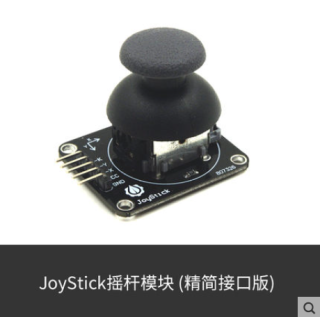
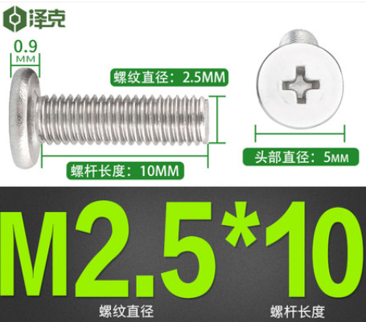

# Xbox Adaptive Controller DIY 开关控制套件图纸

Xbox adaptive controller 自定义控制开关套件和图纸
购买链接，仅供参考!五金零件规格需要一致，轴体、键帽、杜邦线、亚克力工厂等可以自由选择!!

## 单键微动按钮零件列表

 **平均成品单价：18.6元**

|  |  |  |  |  |  |  |  |
| ------------------------------------------------------------ | ------------------------------------------------------------ | ------------------------------------------------------------ | ------------------------------------------------------------ | ------------------------------------------------------------ | ------------------------------------------------------------ | ------------------------------------------------------------ | ------------------------------------------------------------ |
| M2*4平头螺丝4颗                                              | M2*8平头螺丝4颗                                              | 2*6双通圆形螺柱4颗                                           | 康腾特酒红轴1颗                                              | 菜菜垃圾包键帽1个                                            | 杜邦线公对公2条 （长度按需购买）                         | 3.5mm二节单声公转免 焊接插头1个                          | 亚克力切割费用                                               |
| 4.4元（能买到100颗）                                         | 4.7元（能买到100颗）                                         | 3.5元（能买到40颗）                                          | 1元                                                          | 1元                                                          | 2元                                                          | 3.36元                                                       | 30元10份 （足够做10个按钮）                              |
| [购买参考链接](https://detail.tmall.com/item.htm?id=627952509933&spm=a1z09.2.0.0.6d462e8dXdpe8u&_u=e3b7eq17cb87&skuId=4456393808434) | [购买参考链接](https://detail.tmall.com/item.htm?id=627952509933&spm=a1z09.2.0.0.6d462e8dXdpe8u&_u=e3b7eq17cb87&skuId=4456393808438) | [购买参考链接](https://detail.tmall.com/item.htm?id=16348329016&spm=a1z09.2.0.0.6d462e8dXdpe8u&_u=e3b7eq177d95&skuId=33218736229) | 网购渠道搜索购买                                             | 网购渠道搜索购买                                             | [购买参考链接](https://item.taobao.com/item.htm?spm=a1z09.2.0.0.1bdb2e8dQ1Vv1c&id=567943637652&_u=s3b7eq171949) | [购买参考链接](https://detail.tmall.com/item.htm?id=561728920921&spm=a1z09.2.0.0.1bdb2e8do49iY8&_u=s3b7eq175893&skuId=4307108837005) | [购买参考链接](https://shop111329417.taobao.com/shop/view_shop.htm?shop_id=111329417) |

[机械键盘轴体按钮—组装步骤点击直达链接](https://shimo.im/docs/GJDPtxYRpHPWwKqr/read)

------

## 街机按钮零件列表

 **平均成品单价：26.2元**

|  |  |  |  |  |  |  |
| ------------------------------------------------------------ | ------------------------------------------------------------ | ------------------------------------------------------------ | ------------------------------------------------------------ | ------------------------------------------------------------ | ------------------------------------------------------------ | ------------------------------------------------------------ |
| M2*8平头螺丝8颗                                              | M2*20双通圆形螺柱4颗                                         | 街机按键1颗                                                  | 按键线 1条                                                   | 杜邦线公对公2条 （长度按需购买）                         | 3.5mm二节单声公转免 焊接插头1个                          | 亚克力切割费用                                               |
| 4.7元（能买到100颗）                                         | 3.6元（能买到20颗）                                          | 2元                                                          | 0.8元                                                        | 2元                                                          | 3.36元                                                       | 40元10份 （足够做10个按钮）                              |
| [购买参考链接](https://detail.tmall.com/item.htm?id=627952509933&spm=a1z09.2.0.0.6d462e8dXdpe8u&_u=e3b7eq17cb87&skuId=4456393808438) | [购买参考链接](https://detail.tmall.com/item.htm?id=16348329016&spm=a1z09.2.0.0.6d462e8dXdpe8u&_u=e3b7eq177d95&skuId=33218736234) | [购买参考链接](https://item.taobao.com/item.htm?spm=a1z09.2.0.0.1bdb2e8dAfTDSq&id=593682113162&_u=s3b7eq17f980) | [购买参考链接](https://item.taobao.com/item.htm?spm=a1z09.2.0.0.1bdb2e8duIaEK1&id=628778295303&_u=s3b7eq174834) | [购买参考链接](https://item.taobao.com/item.htm?spm=a1z09.2.0.0.1bdb2e8dQ1Vv1c&id=567943637652&_u=s3b7eq171949) | [购买参考链接](https://detail.tmall.com/item.htm?id=561728920921&spm=a1z09.2.0.0.1bdb2e8do49iY8&_u=s3b7eq175893&skuId=4307108837005) | [购买参考链接](https://shop111329417.taobao.com/shop/view_shop.htm?shop_id=111329417) |

[街机按钮—组装步骤点击直达链接](https://shimo.im/docs/QgvRYDP9kydr6wP6/read)

------

## 上下左右组合按钮零件列表

 **平均成品单价：46元**

|  |  |  |  |  |  |  |  |
| ------------------------------------------------------------ | ------------------------------------------------------------ | ------------------------------------------------------------ | ------------------------------------------------------------ | ------------------------------------------------------------ | ------------------------------------------------------------ | ------------------------------------------------------------ | ------------------------------------------------------------ |
| M2*4平头螺丝6颗                                              | M2*8平头螺丝6颗                                              | 2*6双通圆形螺柱6颗                                           | 康腾特酒红轴4颗                                              | 菜菜垃圾包键帽4个                                            | 杜邦线公对公8条 （长度按需购买）                         | 3.5mm二节单声公转免 焊接插头4个                          | 亚克力切割费用                                               |
| 4.4元（能买到100颗）                                         | 4.7元（能买到100颗）                                         | 3.5元（能买到40颗）                                          | 4元                                                          | 1元                                                          | 8元                                                          | 13.44元                                                      | 20元3份 （足够做3个按钮）                                |
| [购买参考链接](https://detail.tmall.com/item.htm?id=627952509933&spm=a1z09.2.0.0.6d462e8dXdpe8u&_u=e3b7eq17cb87&skuId=4456393808434) | [购买参考链接](https://detail.tmall.com/item.htm?id=627952509933&spm=a1z09.2.0.0.6d462e8dXdpe8u&_u=e3b7eq17cb87&skuId=4456393808438) | [购买参考链接](https://detail.tmall.com/item.htm?id=16348329016&spm=a1z09.2.0.0.6d462e8dXdpe8u&_u=e3b7eq177d95&skuId=33218736229) | 网购渠道搜索购买                                             | 网购渠道搜索购买                                             | [购买参考链接](https://item.taobao.com/item.htm?spm=a1z09.2.0.0.1bdb2e8dQ1Vv1c&id=567943637652&_u=s3b7eq171949) | [购买参考链接](https://detail.tmall.com/item.htm?id=561728920921&spm=a1z09.2.0.0.1bdb2e8do49iY8&_u=s3b7eq175893&skuId=4307108837005) | [购买参考链接](https://shop111329417.taobao.com/shop/view_shop.htm?shop_id=111329417) |

[上下左右组合按钮—组装步骤点击直达链接](https://shimo.im/docs/CvqTxC89HQpXYpYj/read)

------

## ABXY组合按钮零件列表

 **平均成品单价：46元**

|  |  |  |  |  |  |  |  |
| ------------------------------------------------------------ | ------------------------------------------------------------ | ------------------------------------------------------------ | ------------------------------------------------------------ | ------------------------------------------------------------ | ------------------------------------------------------------ | ------------------------------------------------------------ | ------------------------------------------------------------ |
| M2*4平头螺丝6颗                                              | M2*8平头螺丝6颗                                              | 2*6双通圆形螺柱6颗                                           | 康腾特酒红轴4颗                                              | 菜菜垃圾包键帽4个                                            | 杜邦线公对公8条 （长度按需购买）                         | 3.5mm二节单声公转免 焊接插头1个                          | 亚克力切割费用                                               |
| 4.4元（能买到100颗）                                         | 4.7元（能买到100颗）                                         | 3.5元（能买到40颗）                                          | 4元                                                          | 1元                                                          | 8元                                                          | 13.44元                                                      | 20元3份 （足够做3个按钮）                                |
| [购买参考链接](https://detail.tmall.com/item.htm?id=627952509933&spm=a1z09.2.0.0.6d462e8dXdpe8u&_u=e3b7eq17cb87&skuId=4456393808434) | [购买参考链接](https://detail.tmall.com/item.htm?id=627952509933&spm=a1z09.2.0.0.6d462e8dXdpe8u&_u=e3b7eq17cb87&skuId=4456393808438) | [购买参考链接](https://detail.tmall.com/item.htm?id=16348329016&spm=a1z09.2.0.0.6d462e8dXdpe8u&_u=e3b7eq177d95&skuId=33218736229) | 网购渠道搜索购买                                             | 网购渠道搜索购买                                             | [购买参考链接](https://item.taobao.com/item.htm?spm=a1z09.2.0.0.1bdb2e8dQ1Vv1c&id=567943637652&_u=s3b7eq171949) | [购买参考链接](https://detail.tmall.com/item.htm?id=561728920921&spm=a1z09.2.0.0.1bdb2e8do49iY8&_u=s3b7eq175893&skuId=4307108837005) | [购买参考链接](https://shop111329417.taobao.com/shop/view_shop.htm?shop_id=111329417) |

[ABXY组合按钮—组装步骤点击直达链接](https://shimo.im/docs/J3ct8y8CghD6dVXp/read)

------

## 小型摇杆零件列表

 **平均成品单价：45元**

|  |  |  |  |  |  |  |  |  |
| ------------------------------------------------------------ | ------------------------------------------------------------ | ------------------------------------------------------------ | ------------------------------------------------------------ | ------------------------------------------------------------ | ------------------------------------------------------------ | ------------------------------------------------------------ | ------------------------------------------------------------ | ------------------------------------------------------------ |
| M2.5*3平头螺丝4颗                                            | M2.5*6平头螺丝12颗                                           | M2.5*6双通六角螺柱4颗                                        | M2.5*20双通六角螺柱4颗                                       | 游戏摇杆按键模块 JoyStick传感器1个 （二选一，都可兼容） | 游戏摇杆按键模块 JoyStick传感器1个 （二选一，都可兼容） | 杜邦线公对母4条 （长度按需购买）                         | 3.5mm四节公转免焊接插头1个                                   | 亚克力切割费用                                               |
| 4.25元（能买到100颗）                                        | 5.1元 （能买到100颗）                                        | 2.71元 （能买到20颗）                                        | 2.8元 （能买到10颗）                                         | 3.43元                                                       | 8元                                                          | 4元                                                          | 4.36元                                                       | 30元3份（足够做3个摇杆）                                     |
| [购买参考链接](https://detail.tmall.com/item.htm?id=627952509933&spm=a1z09.2.0.0.1bdb2e8dtY1ByV&_u=s3b7eq17d979&skuId=4456393808441) | [购买参考链接](https://detail.tmall.com/item.htm?id=627952509933&spm=a1z09.2.0.0.1bdb2e8dtY1ByV&_u=s3b7eq17d979&skuId=4456393808449) | [购买参考链接](https://detail.tmall.com/item.htm?spm=a1z10.3-b-s.w4011-18288959680.12.57e03b2983pVNS&id=17320356113&rn=1722c233ab7375d41359e726df001d6e&abbucket=2&skuId=4920002563089) | [购买参考链接](https://detail.tmall.com/item.htm?spm=a1z10.3-b-s.w4011-18288959680.12.57e03b2983pVNS&id=17320356113&rn=1722c233ab7375d41359e726df001d6e&abbucket=2&skuId=4920002563064) | [购买参考链接](https://detail.tmall.com/item.htm?id=529728518075&spm=a1z09.2.0.0.1bdb2e8dE90pJZ&_u=s3b7eq178624&skuId=4323993115895) | [购买参考链接](https://detail.tmall.com/item.htm?id=637649101440&spm=a1z09.2.0.0.1bdb2e8dE90pJZ&_u=s3b7eq17f961&skuId=4744984122274) | [购买参考链接](https://item.taobao.com/item.htm?spm=a1z09.2.0.0.1bdb2e8dQ1Vv1c&id=567943637652&_u=s3b7eq171949) | [购买参考链接](https://detail.tmall.com/item.htm?id=561728920921&spm=a1z09.2.0.0.1bdb2e8do49iY8&_u=s3b7eq175893&skuId=4307108837009) | [购买参考链接](https://shop111329417.taobao.com/shop/view_shop.htm?shop_id=111329417) |

[小型摇杆—组装步骤点击直达链接](https://shimo.im/docs/RvdYkpqp8QqhHYVp/read)

------

## 大型摇杆零件列表

 **平均成品单价：178元**

|  |  |  |  |  |  |  |  |  |  |
| ------------------------------------------------------------ | ------------------------------------------------------------ | ------------------------------------------------------------ | ------------------------------------------------------------ | ------------------------------------------------------------ | ------------------------------------------------------------ | ------------------------------------------------------------ | ------------------------------------------------------------ | ------------------------------------------------------------ | ------------------------------------------------------------ |
| M2.5*6平头螺丝 4颗                                           | M2.5*10平头螺丝 4颗                                          | M5*10平头螺丝 3颗                                            | M2.5*30双通六角螺柱 4颗                                      | Arduino摇杆模块 1个                                          | 档杆球头 1个                                                 | 螺纹转换器 1个                                               | 杜邦线公对公4条 （长度按需购买）                         | 3.5mm四节公转免焊接插头 1个                                  | 亚克力切割费用                                               |
| 5.1元 （能买到100颗）                                        | 5.4元 （能买到100颗）                                        | 6元 （能买到50颗）                                           | 4.3元 （能买到10颗）                                         | 85元                                                         | 46元                                                         | 18元                                                         | 4元                                                          | 4.36元                                                       | 30元3份（足够做3个摇杆）                                     |
| [购买参考链接](https://detail.tmall.com/item.htm?id=627952509933&spm=a1z09.2.0.0.1bdb2e8dtY1ByV&_u=s3b7eq17d979&skuId=4456393808449) | [购买参考链接](https://detail.tmall.com/item.htm?id=627952509933&spm=a1z09.2.0.0.1bdb2e8dtY1ByV&_u=s3b7eq17d979&skuId=4456393808448) | [购买参考链接](https://detail.tmall.com/item.htm?id=627952509933&spm=a1z09.2.0.0.1bdb2e8dtY1ByV&_u=s3b7eq17d979&skuId=4632370363159) | [购买参考链接](https://detail.tmall.com/item.htm?spm=a1z10.3-b-s.w4011-18288959680.12.57e03b2983pVNS&id=17320356113&rn=1722c233ab7375d41359e726df001d6e&abbucket=2&skuId=4920002563055) | [购买参考链接](https://detail.tmall.com/item.htm?id=637649101440&spm=a1z09.2.0.0.1bdb2e8dE90pJZ&_u=s3b7eq17f961&skuId=4744984122280) | [购买参考链接](https://item.taobao.com/item.htm?spm=a1z09.2.0.0.1bdb2e8dJfLPwJ&id=605822483215&_u=s3b7eq17d4e9) | [购买参考链接](https://item.taobao.com/item.htm?spm=a1z09.2.0.0.1bdb2e8dJfLPwJ&id=605822483215&_u=s3b7eq17d4e9) | [购买参考链接](https://item.taobao.com/item.htm?spm=a1z09.2.0.0.1bdb2e8dQ1Vv1c&id=567943637652&_u=s3b7eq171949) | [购买参考链接](https://detail.tmall.com/item.htm?id=561728920921&spm=a1z09.2.0.0.1bdb2e8do49iY8&_u=s3b7eq175893&skuId=4307108837009) | [购买参考链接](https://shop111329417.taobao.com/shop/view_shop.htm?shop_id=111329417) |

[大型摇杆—组装步骤点击直达链接](https://shimo.im/docs/rYHpvqjhgQRRJ8RG/read)

------

